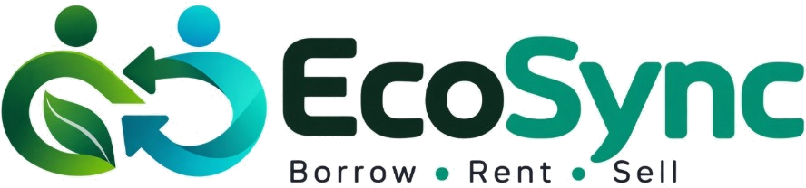

<div align="center">
  
</div>

# EcoSync 🌱
EcoSync is a modern, AI-powered community resource-sharing platform. It connects people locally to borrow, lend, rent, and donate underutilized items like books, tools, electronics, and sports equipment.

## Features
- **Local Discovery:** Find items available nearby using a built-in map.
- **AI Recommendations:** Get smart suggestions based on your past activity and proximity.
- **Secure Transactions:** Built-in chat, availability calendar, and request management.
- **Community Safety:** Public profiles, ratings, user blocking, and reporting mechanisms.

## Tech Stack
- **Frontend:** React, Tailwind CSS, Vite, React-Leaflet
- **Backend:** Python, Flask, SQLAlchemy, JWT Authentication
- **AI Integration:** Groq API (Llama3/Mixtral) for intelligent condition assessment and recommendations
- **Database:** SQLite (development)

---

## 🚀 Quick Start Guide

### 1. Clone the Repository
Start by cloning the project to your local machine:
```bash
git clone https://github.com/ParthInamdar/ECOsync.git
cd ECOsync
```

### 2. Backend Setup (Flask API)
The backend is powered by Python and Flask.

```bash
# Navigate to the backend directory
cd backend

# Create a virtual environment
python -m venv .venv

# Activate the virtual environment
# On Windows:
.venv\Scripts\activate
# On Mac/Linux:
source .venv/bin/activate

# Install dependencies
pip install -r requirements.txt

# Set up environment variables
# Copy .env.example to .env and add your Groq API key
cp .env.example .env

# Initialize the database
python scripts/init_db.py

# Run the backend server (starts on http://localhost:5000)
python run.py
```

### 3. Frontend Setup (React/Vite)
The frontend uses React and is built with Vite.

```bash
# Open a new terminal and navigate to the frontend directory
cd frontend

# Install dependencies
npm install

# Run the development server (starts on http://localhost:5173)
npm run dev
```

### 4. Open the App
Visit [http://localhost:5173](http://localhost:5173) in your browser. You can create a new account or log in as an existing user to explore EcoSync!
